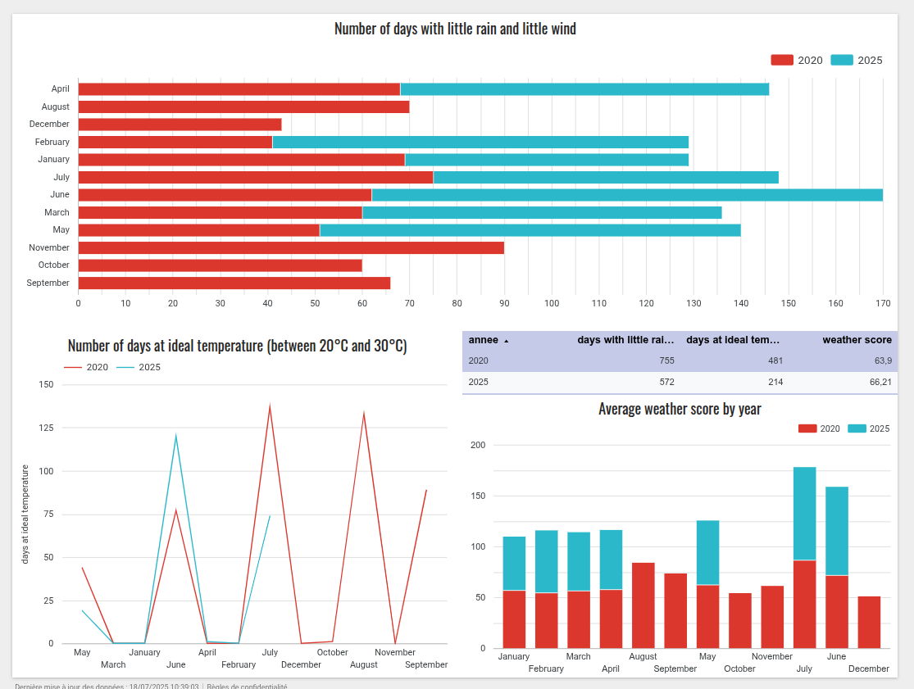

# **WEATHER DASHBOARD PROJECT**

## Climate and Tourism — *When to Travel?*

---

## Project Structure


---

## DAG Airflow

#### Operating mode:

1. Make sure you have all the necessary dependencies.

2. Run DAG with the following commands:
   ```bash
   airflow api-server
   airflow scheduler
   airflow dag-processor

3. Activate weather_historical_init:
- Extracts historical data from 2020-01-01 to 2025-06-29 (source: visualcrossing.com)
- Cleans data to make it ready for merging (historical/historical_cleaned)
- To be activated manually for future runs


4. Activate weather_daily_pipeline:
- Retrieves daily data (source: openweathermap.org)
- Merges recent data (/processed) with cleaned historical data (historical/historical_cleaned)
- Generates file /final/historical_weather.csv
- Creates star model in /final/star_schema
  

5. Beware of modifications:
- If the historical.csv, /raw/ or /processed/ files are modified, you must:
  - Delete historical_weather.csv(final data)
  - Delete all files in /star_schema(final data)
  - Relaunch weather_historical_init then weather_daily_pipeline


6- Recommended update order:
weather_historical_init ➝ weather_daily_pipeline

---

## DIAGRAM

#### **Star model diagram**


- The fact table: **fact_weather**
- Dimensions:
  - **dim_city**: contains cities
  - **dim_date**: contains dates
  - **dim_conditions**: contains types of weather conditions
 
---

## EDA
**init_EDA.ipynb**: exploratory analysis before data processing

It allows you to:
- understand data structure
- identify trends and anomalies
- make pre-processing decisions


**final_EDA.ipynb**: exploratory analysis after data processing

It enables you to:
- validate the quality of processed data
- identify the best tourist periods
- generate actionable insights

---

## DASHBOARD

#### **Previews**:

City display :


This second page illustrates the following weather indicators:
- days with ideal temperatures (between 20°C and 30° C)
- days with less rain and wind
- weather scores by month


And finally, still using the same meteorological indicators, we compare the evolution of weather conditions between the two years 2020 and 2025:

