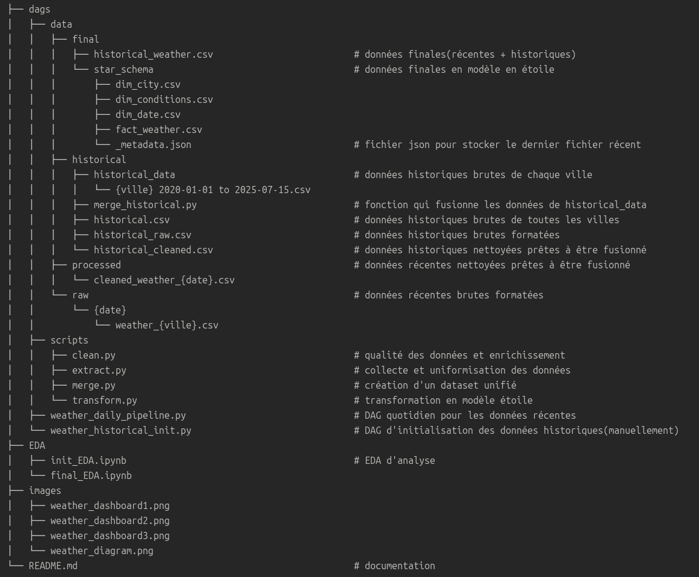

# **WEATHER DASHBOARD PROJECT**

## Climate and Tourism — *When to Travel?*

---

## Project Structure



---

## DAG Airflow

#### Mode de fonctionnement :

1. S’assurer d’avoir toutes les dépendances nécessaires.

2. Lancer le DAG avec les commandes suivantes :
   ```bash
   airflow api-server
   airflow scheduler
   airflow dag-processor

3. Activer weather_historical_init:
- Extrait les données historiques de 2020-01-01 à 2025-06-29 (source : visualcrossing.com)
- Nettoie les données pour les rendre prêtes à la fusion (historical/historical_cleaned)
- À activer manuellement pour les prochaines exécutions


4. Activer weather_daily_pipeline :
- Récupère les données du jour(source : openweathermap.org)
- Fusionne les données récentes (/processed) avec les données historiques nettoyées (historical/historical_cleaned)
- Génère le fichier /final/historical_weather.csv
- Crée le modèle en étoile dans /final/star_schema
  

5. Attention aux modifications :
- Si les fichiers historical.csv, /raw/ ou /processed/ sont modifiés, il faut :
  - Supprimer historical_weather.csv(données finales)
  - Supprimer tous les fichiers dans /star_schema(données finales)
  - Relancer weather_historical_init puis weather_daily_pipeline


6- Ordre de mise à jour recommandé :
weather_historical_init ➝ weather_daily_pipeline

---

## DIAGRAM

#### **Schéma du modèle en étoile**


- La table de faits : **fact_weather**
- Les dimensions :
  - **dim_city** : contient les villes
  - **dim_date** : contient les dates
  - **dim_conditions** : contient les types de conditions météorologiques
 
---

## EDA
**init_EDA.ipynb** : analyse exploratoire avant traitement des données

Elle m'a permis de :
- comprendre la structre des données
- identifier des tendances et anomalies
- prendre des décisions pour le pré-traitement


**final_EDA.ipynb** : analyse exploratoire après traitement des données

Elle m'a permis de : 
- valider la qualité des données traitées
- identifier les meilleures périodes touristiques
- générer des insights actionnables

---

## DASHBOARD

#### **Previews** :


